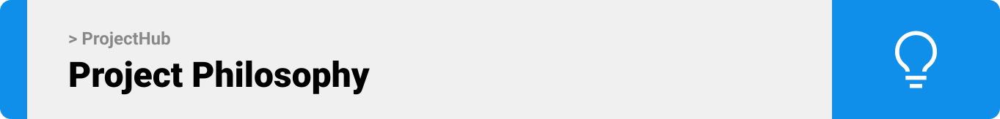
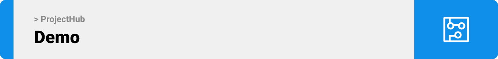

<br><br>

<!-- project philosophy -->


A platform that collaborates project engineers process in a professional and easier way, engaging owner and manager with project process, real-time communication between engineers about issues and updates and their several other features.

Communication between engineer can increase the work functionality and troubleshooting 
With my project features engineers can create their own virtual world and collaborate. Sharing Files, comment , issues discussion, manage contact is usually done by emails. I’m looking to provide platform that join all this section and more, project files section where can create several beaches to update before modify the main one and find the old files by filtering, issue section with status  of the issue and ability to discuss and tag user, manager overview of work process, real-time engage with site engineer daily tasks and reports,chat rooms,budget control and analyze.

### User Stories

- As a user, I want to upload my files so that I can share them with team members.
- As a user, I want to create a new branch so that I can post my team files separately.
- As a user, I want to download files so that I can save them locally.
- As a user, I want to post my issue so that I can share it.
- As a user, I want to filter the issue section so that I can search for specific objects.
- As a user, I want to tag specific members related to my issue so that I can be more direct.
- As a user, I want to create a new branch so that I can post unapproved update files without modifying the original.
- As a user, I want to check my daily tasks so that I can be more organized. 
- As a user, I want a chat room so that I can talk to other engineers and managers about what I'm facing.
- As a manager, I want to see all project titles so that I can be organized.
- As a manager, I want to add users for projects so that I can be in control.
- As a manager, I want to approve files from members so that I can organize uploaded files.  
- As a manager, I want to check member daily tasks so that I can stay updated.
- As a manager, I want to remove files so that I can minimize the number of unused files.
- As a manager, I want to accept files so that I can control uploaded files.


<br><br>

<!-- Prototyping -->


### Wireframes
| Login screen  | Register screen |  Landing screen |
| ---| ---| ---|
|  |  |  |

### Mockups
| Login screen  | Menu Screen | Order Screen |
| ---| ---| ---|
|  |  |  |

<br><br>

<!-- Implementation -->


> Using the wireframes and mockups as a guide, we implemented the Coffee Express app with the following features:

### User Screens (Mobile)
| Login screen  | Register screen | Landing screen | Loading screen |
| ---| ---| ---| ---|
|  |  |  |  |
| Home screen  | Menu Screen | Order Screen | Checkout Screen |
|  |  |  |  |

### Admin Screens (Web)
| Login screen  | Register screen |  Landing screen |
| ---| ---| ---|
|  |  |  |
| Home screen  | Menu Screen | Order Screen |
|  |  |  |

<br><br>

<!-- Tech stack -->


###  ProjectHub is built using the following technologies:

- This project uses the [Flutter app development framework](https://flutter.dev/). Flutter is a cross-platform hybrid app development platform which allows us to use a single codebase for apps on mobile, desktop, and the web.
- For persistent storage (database), the app uses the [Hive](https://hivedb.dev/) package which allows the app to create a custom storage schema and save it to a local database.
- To send local push notifications, the app uses the [flutter_local_notifications](https://pub.dev/packages/flutter_local_notifications) package which supports Android, iOS, and macOS.
  - 🚨 Currently, notifications aren't working on macOS. This is a known issue that we are working to resolve!
- The app uses the font ["Work Sans"](https://fonts.google.com/specimen/Work+Sans) as its main font, and the design of the app adheres to the material design guidelines.

<br><br>

<!-- How to run -->


> To set up ProjectHub locally, follow these steps:

### Prerequisites

This is an example of how to list things you need to use the software and how to install them.
* npm
  ```sh
  npm install npm@latest -g
  ```

### Installation

_Below is an example of how you can instruct your audience on installing and setting up your app. This template doesn't rely on any external dependencies or services._

1. Get a free API Key at [https://example.com](https://example.com)
2. Clone the repo
   ```sh
   git clone https://github.com/your_username_/Project-Name.git
   ```
3. Install NPM packages
   ```sh
   npm install
   ```
4. Enter your API in `config.js`
   ```js
   const API_KEY = 'ENTER YOUR API';
   ```

Now, you should be able to run Coffee Express locally and explore its features.
