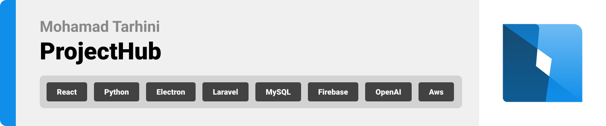

<br><br>

<!-- project philosophy -->


A platform that collaborates project engineers process in a professional and easier way, engaging owner and manager with project process, real-time communication between engineers about issues and updates and their several other features.

Communication between engineer can increase the work functionality and troubleshooting 
With my project features engineers can create their own virtual world and collaborate. Sharing Files, comment , issues discussion, manage contact is usually done by emails. I’m looking to provide platform that join all this section and more, project files section where can create several beaches to update before modify the main one and find the old files by filtering, issue section with status  of the issue and ability to discuss and tag user, manager overview of work process, real-time engage with site engineer daily tasks and reports,chat rooms,budget control and analyze.

### User Stories

- As a user, I want to upload my files so that I can share them with team members.
- As a user, I want to receive updated and modified files so that I can stay informed.
- As a user, I want to create a new branch so that I can post my files separately.
- As a user, I want to create a new branch so that I can post unapproved update files without modifying the original.
- As a user, I want to create a new copy of the main file so that I can make changes in it.
- As a user, I want to check if there are any conflicts between my files and the main one so that I can stay organized.
- As a user, I want to accept or reject files before uploading them so that I can maintain control.
- As a user, I want to request permission to upload a new version to the main branch so that I can share my work.
- As a user, I want to view my old updates so that I can reuse them.
- As a user, I want to create a chat room with other members so that I can communicate and share opinions.
- As a user, I want to organize my daily tasks in a sequential manner so that I can work efficiently.
- As a user, I want to review my daily tasks so that I can stay organized.
- As a user, I want to schedule my tasks by priority so that I can manage my workload effectively.
- As a user, I want to share my issues so that I can resolve them faster.
- As a user, I want to tag specific members related to my issue so that I can communicate directly.
- As a manager, I want to see all project titles so that I can stay organized.
- As a manager, I want to add users to projects so that I can maintain control.
- As a manager, I want to approve files from members so that I can ensure quality and organization.
- As a manager, I want to create new teams so that I can enhance work quality.
- As a manager, I want to add and remove members so that I can control the budget and work capacity.
- As a manager, I want to change project statuses so that I can manage my projects effectively.

<br><br>

<!-- Prototyping -->


### Mockups
| Login screen  | Dashboard Section | Issues Section |
| ---| ---| ---|
|  |  |  |

| Tasks Section  | Loading screen |  Files Section |
| ---| ---| ---|
|  |  |  |


<br><br>

<!-- Implementation -->


> Using the wireframes and mockups as a guide, we implemented the Coffee Express app with the following features:


### Admin Screens (Desktop)
| Dshbored Section  | Project Section |  Team Members screen |
| ---| ---| ---|
|  |  |  |
| Home screen  | Menu Screen | Order Screen |
|  |  |  |

<br><br>

<!-- Tech stack -->


###  ProjectHub is built using the following technologies:

- This project uses the [Electron app development framework](https://www.electronjs.org/). Electron embeds Chromium and Node.js to enable web developers to create desktop applications.
- For persistent storage (database), the app uses [MySQL](https://www.mysql.com/) package which allows the app to create a custom storage schema and save it to a local database.
- On paralllel with Electron I Used [Python](https://www.python.org/) where is a programming language that lets you work more quickly and integrate your systems more effectively.
- As a Frontend [React](https://react.dev/) that declarative, efficient, and flexible JavaScript library for building user interfaces or UI components.

<br><br>

<!-- How to run -->


> To set up ProjectHub locally, follow these steps:

### Prerequisites

This is an example of how to list things you need to use the software and how to install them.
* npm
  ```sh
  npm install npm@latest -g
  ```

### Installation

_Below is an example of how you can instruct your audience on installing and setting up your app. This template doesn't rely on any external dependencies or services._

1. Clone the repo
   ```sh
   git clone https://github.com/MhdTarhini/ProjectHub.git
   ```
2. Install NPM packages
   ```sh
   npm install
   ```
3. Enter eletron file
   ```js
   cd electron
   ```
4. Run React
   ```js
   npm run react:start
   ```
5. Run Electron
   ```js
   npm run eletron:start
   ```

Now, you should be able to run ProjectHub locally and explore its features.
