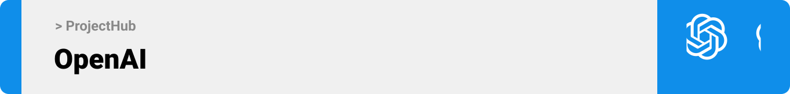

<br><br>

 


- [Project Description](#project-description)
- [User Types Stories](#user-types)
- [Features of the App](#features-of-the-app)
- [Tech Stack](#tech-stack)
- [Prototyping](#prototyping)
- [Demo](#Demo)
- [OpenAi](#OpenAi)
- [Performance](#Performance)
- [How to Run](#how-to-run)
  - [Prerequisites](#prerequisites)
  - [Installation](#installation)


<!-- project philosophy -->
<a name="project-description"></a>


A platform that collaborates project engineers process in a professional and easier way, engaging owner and manager with project process, real-time communication between engineers about issues and updates and their several other features.

Communication between engineer can increase the work functionality and troubleshooting 
With my project features engineers can create their own virtual world and collaborate. The platform empowers users with advanced version control, allowing them to identify conflicts between their files and the primary versions. They can review all changes and potential conflicts, deciding whether to accept or reject them. This ensures users always have control over their content. The ability to share issues and communicate about them is vital. However, the most important feature is managing their tasks using a Gantt Chart that provides the best management practices

I'm looking to incorporate AI more extensively by analyzing plan details and suggesting solutions to any problem based on historical data. Additionally, I aim to assist engineers by structuring and designing buildings, focusing on the concrete and steel aspects, as well as in an architectural manner.

<a name="User Types"></a>
### User Stories

- As a user, I want to upload my files so that I can share them with team members.
- As a user, I want to create a new branch so that I can post my files separately.
- As a user, I want check files details so that I can have knowladge.
- As a user, I want to create a new branch so that I can post unapproved update files without modifying the original.
- As a user, I want to create a new copy of the main file so that I can make changes in it.
- As a user, I want to view my old updates so that I can reuse them.
- As a user, I want to schedule my tasks by priority so that I can manage my workload effectively.
- As a user, I want to tag specific members related to my issue so that I can communicate directly.

### Manager Stories

- As a manager, I want to see all project titles so that I can stay organized.
- As a manager, I want to add users to projects so that I can maintain control.
- As a manager, I want to approve files from members so that I can ensure quality and organization.
- As a manager, I want to create new teams so that I can enhance work quality.
- As a manager, I want to add and remove members so that I can control the budget and work capacity.
- As a manager, I want to change project statuses so that I can manage my projects effectively.

<br><br>
<!-- Prototyping -->
<a name="prototyping"></a>


### Mockups
| Login screen  | Dashboard Section | Issues Section |
| ---| ---| ---|
|  |  |  |

<br><br>

<!-- Tech stack -->
<a name="tech-stack" ></a>


###  ProjectHub is built using the following technologies:

- This project uses the [Electron framework](https://www.electronjs.org/). Electron embeds Chromium and [Node.js](https://nodejs.org/en) to enable web developers to create desktop applications.
- For persistent storage (database), the app uses [MySQL](https://www.mysql.com/) package which allows the app to create a custom storage schema and save it to a local database.
- On paralllel with Electron I Used [Python](https://www.python.org/) where is a programming language that lets you work more quickly and integrate your systems more effectively.
- As a Frontend [React](https://react.dev/) that declarative, efficient, and flexible JavaScript library for building user interfaces or UI components.
- For handling database records I used [Laraverl](https://laravel.com/) that include Eloquent where is an object relational mapper (ORM).
- [Firbase](https://firebase.google.com/?gad=1&gclid=CjwKCAjwseSoBhBXEiwA9iZtxsTCyMaNaWShkDwkOZYQTfNahGinS-OquPbbTv-_aUAEuz1BWX6ACBoCNA0QAvD_BwE&gclsrc=aw.ds) To Enable [Google](https://mail.google.com/) Auth & Create rooms for real-time messaging between Teams member .
- [OpenAI](https://openai.com/) to read the plan details and content, and provide the area and dimensions of each object.
- [aws](https://aws.amazon.com/) Hosting the server side [Laraverl](https://laravel.com/) on IP Address: 34.244.172.132 

<br><br>

<!-- Implementation -->

<a name="Demo" ></a>

> Using the wireframes and mockups as a guide, we implemented the ProjectHub app with the following features:


### User Screens (Desktop)


| Tasks Section  | Loading Screen |  Files Section |
| ---| ---| ---|
|  |  |  |

### Admin Screens (Desktop)


| Dshbored Section  | Project Section |  Team Members screen |
| ---| ---| ---|
|  |  |  |


<br><br>

<a name="OpenAi" ></a>


> POST http://34.244.172.132/api/file-section/open_ai
```js
data : {'Slab': [{'prop': {'L,W': (55.4, 68.3), 'Area': 2457.283}, 'quantity': 1}], 'opening': [{'prop': {'L,W': (3.0, 4.9), 'Area': 14.7}, 'quantity': 1}, {'prop': {'L,W': (4.6, 2.2), 'Area': 10.12}, 'quantity': 1}, {'prop': {'L,W': (2.8, 2.8), 'Area': 7.84}, 'quantity': 1}], 'Columns': [{'prop': {'L,W': (0.6, 0.2), 'Area': 
0.12}, 'quantity': 69}, {'prop': {'L,W': (0.2, 0.6), 'Area': 0.12}, 'quantity': 2}], 'shear wall': [{'prop': {'L,W': (3.2, 5.1), 'Area': 16.32}, 'quantity': 1}, {'prop': {'L,W': (3.0, 5.0), 'Area': 7.5}, 'quantity': 1}, {'prop': {'L,W': (2.8, 5.5), 'Area': 7.7}, 'quantity': 1}, {'prop': {'L,W': (4.8, 3.5), 'Area': 14.16}, 'quantity': 1}, {'prop': {'L,W': (7.0, 1.6), 'Area': 11.2}, 'quantity': 1}, {'prop': {'L,W': (7.0, 4.2), 'Area': 7.0}, 'quantity': 1}]}
```
Response : 
```js
This Plan Contine Slab with 55.4 m*68.3m Area: 2457.283 m2, Opening with L,W: 3.0 m, 4.9 m Area: 14.7 m2, L,W: 4.6 m, 2.2 m Area: 10.12 m2,L,W: 2.8 m, 2.8 m Area: 7.84 m2, Columns with L,W: 0.6 m, 0.2 m Area: 0.12 m2 Quantity: 69, L,W: 0.2 m, 0.6 m Area: 0.12 m2 Quantity: 2, Shear wall L,W: 3.2 m, 5.1 m Area: 16.32 m2 Quantity: 1 L,W: 3.0 m, 5.0 m Area: 7.5 m2 Quantity: 1 L,W: 2.8 m, 5.5 m Area: 7.7 m2 Quantity: 1 L,W: 4.8 m, 3.5 m Area: 14.16 m2 Quantity: 1 L,W: 7.0 m, 1.6 m Area: 11.2 m2 Quantity: 1 L,W: 7.0 m, 4.2 m Area: 7.0 m2 Quantity: 1
```
<br><br>


<a name="Performance" ></a>
 
> The following tests were conducted in Postman to assess the functionality of my application's primary APIs.

> URL : http://34.244.172.132/api/file-section/get_files
```js
PASS
The data length must be greater than zero
PASS
Response time is within acceptable range
```
> URL : http://34.244.172.132/api/file-section/open_ai
```
Status = 200OK Time = 5.40 s
```

<br><br>


<!-- How to run -->


> To set up ProjectHub locally, follow these steps:

### Prerequisites

This is an example of how to list things you need to use the software and how to install them.
* npm
  ```sh
  npm install npm@latest -g
  ```

### Installation

_Below is an example of how you can instruct your audience on installing and setting up your app. This template doesn't rely on any external dependencies or services._

1. Clone the repo
   ```sh
   git clone https://github.com/MhdTarhini/ProjectHub.git
   ```
2. Install NPM packages
   ```sh
   npm install
   ```
3. Enter eletron file
   ```js
   cd electron .\venv\Scripts\activate
   ```
4. Activate Python Env.
   ```js
   .\venv\Scripts\activate
   ```
5. Run React
   ```js
   npm run react:start
   ```
6. Run Electron
   ```js
   npm run eletron:start
   ```

### Postman Collection
[ProjectHub API's](./readme/ProjectHub-API's.postman_collection.json)
### Demo Accounts

- email: loren@gmail.com, password: 1234567, and role: Manager of 2 projects (Hospital, Building) only Hospital project is Active.
- email: leonardo@gmail.com, password: 1234567, and role: member in Architect Team in hospital project.
- email: tala@gmail.com, password: 1234567, and role:  member in Site Team at hospital project.
- email: tony@gmail.com, password:1234567, and role: member in Office Team at building project (pending project)

Now, you should be able to run ProjectHub locally and explore its features.
